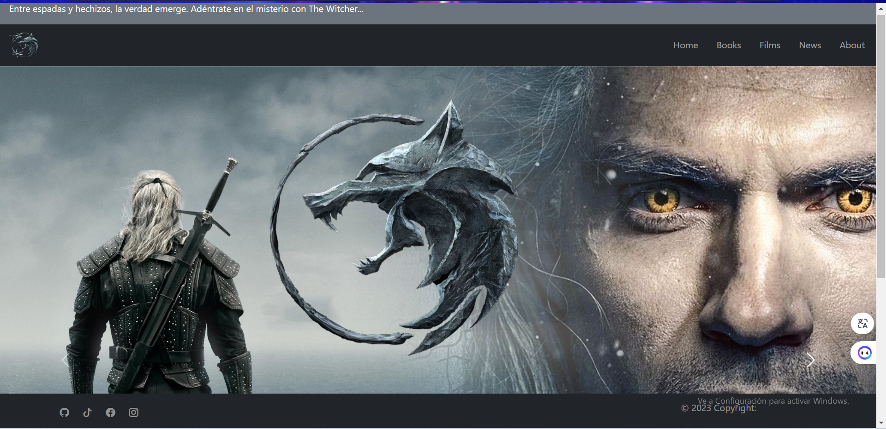

# The-Whitcher


<h1>Se trata sobre una página tributo a la Saga literaria y televisiva de the whitcher ,</h1>
<p>Se a desado crear un tributo a la saga del Brujo el lobo blanco, como es llamado queriendo presentar una variedad de elementos al usuario donde pueda consultar sobre los libros el autor o la serrie de netflix.</p>


## :bangbang: Requisitos previos

- Es un proyecto desarrollado en Vue.js 3, usando Pinia, Vue Router, Boostrap 5 y Sass.
## Capturas de Pantalla


## Recommended IDE Setup

[VSCode](https://code.visualstudio.com/) + [Volar](https://marketplace.visualstudio.com/items?itemName=Vue.volar) (and disable Vetur) + [TypeScript Vue Plugin (Volar)](https://marketplace.visualstudio.com/items?itemName=Vue.vscode-typescript-vue-plugin).

## Customize configuration

See [Vite Configuration Reference](https://vitejs.dev/config/).

## Project Setup

```sh
npm install
```

### Compile and Hot-Reload for Development

```sh
npm run dev
```

### Compile and Minify for Production

```sh
npm run build
```

### Run Unit Tests with [Vitest](https://vitest.dev/)

```sh
npm run test:unit

